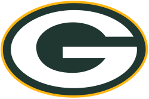
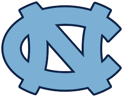

<h1 style="margin:0; font-size:1.5em;">
Sam Sieloff
</h1>

  

I’m an aspiring data scientist with a passion for turning messy, complex data into clear, actionable insights. In my work, I focus on building scalable reporting and analytics systems that help teams and leadership make better, faster decisions based on data they can actually trust.

My interest in data and sports goes back as long as I can remember. It started with tracking stats for made up wiffleball games in the backyard and eventually turned into a deeper curiosity about performance, patterns, and decision making. Over time, that curiosity grew into a real interest in how data can be used to understand not just what is happening, but why it’s happening.

That mindset has carried into both my career and personal projects, where I’ve worked across BI, automation, reporting, and modeling. I enjoy taking systems that are messy, manual, or disconnected and turning them into something structured and useful.

Outside of data work, I’ve always been competitive. I played baseball through college, including on the club baseball team at Purdue, which was a big part of how I first learned to think about performance in a structured way. More recently, I’ve also gotten into cycling, where I still race in local and regional mountain bike events. Both sports have shaped how I think about improvement, consistency, and performance over time.

At this point, a lot of what I enjoy about data is the same thing I’ve always liked about sports, trying to understand what actually drives outcomes, finding patterns that aren’t obvious at first glance, and using that information to make better decisions.

---

<h2 style="margin:0; font-size:1.5em;">
What I'm interested in
</h2>

- Sports analytics (MLB, NASCAR, NHL)
- Fantasy Sports and Sports Betting (Still trying to figure out how to consistently beat Vegas...)
- Sports science and performance optimization. Keeping athletes on the field and performing at their best  

---

<h2 style="margin:0; font-size:1.5em;">
Interests Outside of Work
</h2>

### Watching some of favorite teams
  

  
  
  
  

### Other interests
- Reading a good book. Two of my favorite authors are Stephen King & Nate Silver. 
- Traveling with my fiancée (recent trips include: Italy, Greece, London & Paris)
- Riding my bike and training for my next race.
- Playing Piano. I've played for 20+ years and perform at weddings, funerals, and weekly in our church worship group.

---

<h2 style="margin:0; font-size:1.5em;">
Let's Connect!
</h2>

If anything here caught your eye, please reach out! I’m always open to talking about collaborations or just chatting about sports, data, and anything in between.

  

  

