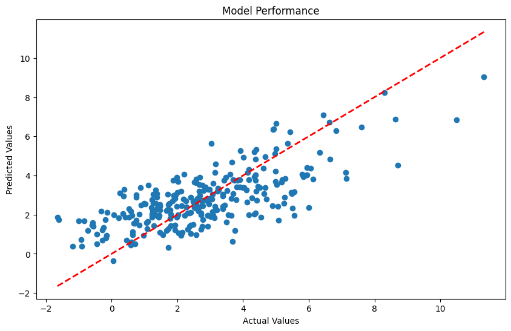
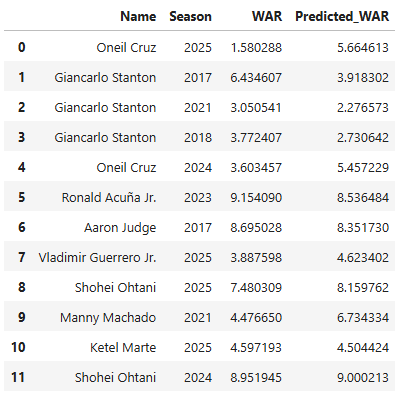
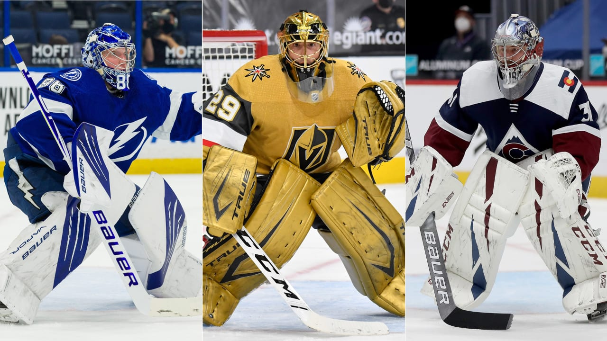

<h1 style="margin:0; font-size:1.5em;">
 Personal Data & Analytics Work
</h1>

These projects are built outside of my professional work and are focused on exploring machine learning, predictive modeling, and sports analytics.

My interests center around applying data science to sports like **MLB, NASCAR, and NHL**, where I experiment with modeling player performance, game outcomes, and statistical trends.

---

<h2 style="margin:0; font-size:1.5em;">
  MLB WAR Prediction Model
</h2>

Built a machine learning model to predict MLB player WAR using Statcast derived offensive metrics and positional information.

  

WAR (Wins Above Replacement) is one of the most comprehensive measures of player value, combining offense, defense, and baserunning into a single metric. This project focused on whether WAR can be approximated using only underlying measurable skill indicators.

The model used linear regression to map player level features such as barrel rate, walk rate, strikeout rate, exit velocity, launch angle, and positional adjustments to total WAR.

Results showed that offensive quality of contact and plate discipline were the strongest predictors of WAR. Barrel% and BB% had the largest positive impact, while strikeout rate negatively affected predicted value. Adding positional indicators improved performance by capturing defensive value differences across positions.

The final model explained a substantial portion of WAR variation (R² ≈ 0.60), demonstrating that much of player value can be estimated from offensive and positional data alone.

  

<a href="https://github.com/sieloffs/MLB-Analytics/blob/main/WAR%20Modeling.ipynb" 
   target="_blank"
   style="display:inline-block; padding:8px 12px; background:#000; color:#fff; border-radius:6px; text-decoration:none;">
   Open GitHub Code
</a>

---

<h2 style="margin:0; font-size:1.5em;">
  Goalie Selection Model
</h2>

Built a machine learning model using millions of NHL tracking data points to explore how teams can make better goalie start decisions.

  

Worked with a team to move beyond traditional stats by focusing on recent performance trends using weighted game history and rolling metrics to better reflect how goalies are actually playing going into a game.

---

<h2 style="margin:0; font-size:1.5em;">
  Pit Stop Performance Analysis
</h2>

Analyzed NASCAR pit stop performance to understand how pit crew execution impacts race outcomes in the 2024 season.

  

Pit stops play a critical role in NASCAR, where races are often decided by fractions of a second. Even small mistakes on pit road can lead to significant position changes over the course of a race.

This project explored how pit stop efficiency relates to finishing position by analyzing stop times, positions gained or lost, and overall crew consistency.

Key findings showed that slow pit stops have a measurable impact on race results, with each slow stop associated with roughly one lost finishing position. Driver consistency over the season also emerged as a strong predictor of race outcomes, even more so than starting position in many cases.

  

<a href="https://github.com/sieloffs/NASCAR-Analytics/blob/main/Data%20720%20Final%20Project.ipynb" 
   target="_blank"
   style="display:inline-block; padding:8px 12px; background:#000; color:#fff; border-radius:6px; text-decoration:none;">
   Open GitHub Code
</a>

---

# 🔎 Related Pages

- 💼 [Work Projects](/projects-work)
- 📁 [Projects Overview](/projects)
