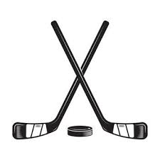
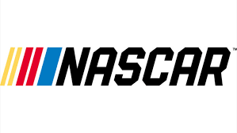

# Personal Data Science & Sports Analytics Projects

These projects are built outside of my professional work and are focused on exploring machine learning, predictive modeling, and sports analytics.

My interests center around applying data science to sports like **MLB, NASCAR, and NHL**, where I experiment with modeling player performance, game outcomes, and statistical trends.

---

<h2>
   Hockey Analytics
  
</h2>

### Goalie Selection Model {#nhl-goalie}

  

Built a machine learning model using millions of NHL tracking data points to explore how teams can make better goalie start decisions.

Worked with a team to move beyond traditional stats by focusing on recent performance trends using weighted game history and rolling metrics to better reflect how goalies are actually playing going into a game.

---
<h2>
   NASCAR Analytics
  
</h2>

### Slow Pit Stop Model {#nhl-goalie}

  

Update this section

---

# 🧰 Tools & Techniques

- Python (pandas, scikit-learn, XGBoost)  
- Data visualization (matplotlib, seaborn)  
- Feature engineering  
- Time series & regression modeling  
- Sports analytics datasets  

---

# 🔎 Related Pages

- 💼 [Work Projects](/projects-work)
- 📁 [Projects Overview](/projects)
