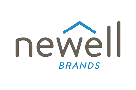
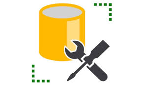

<h1 style="margin:0; font-size:1.5em;">
  Professional Data & Analytics Work
</h1>

  
  
  
  

---

I’ve worked across BI, automation, and analytics roles where I build tools that turn messy data into something teams can actually use for decision making.

In roles at **Newell Brands** and **Lids**, I’ve built dashboards, automation pipelines, and analytics systems supporting leadership across sales, forecasting, pricing, and operations.

No matter the role, my goal is: take raw data → clean it → automate it → turn it into decisions people actually use.

---

## Sections

- [Automation & Data Engineering](/projects-work#Automation)
- [Business Intelligence & Reporting](/projects-work#BI)
- [Analytics & Decision Science](/projects-work#Analytics)
 

---

<h2 style="margin:0; font-size:1.5em;">
  Automation & Data Engineering
</h2>

 
   
   
   

Projects focused on reducing manual work, connecting disconnected systems, and building scalable internal tools that help teams move faster with cleaner data.

---
### D365 Upload Automation:  

#### Python | SQL | Azure

Automated a daily manual process during a cloud database migration, saving 5+ hours per week and improving reliability.

- Legacy systems still required daily uploads from Azure based data sources
- Built a Python script to automatically retrieve files and load them into SQL
- Added error checks so only exceptions needed manual review
- Replaced a reptitive 1–2 hour daily task with an automated workflow

---

### Comprehensive Promotional Planning Tool
#### Power Automate | Excel | Data Modeling

Built a scalable promotional planning system that improved accuracy, and decision making accross teams.

- Created a single source of truth master planning file with built in governance and automation
-  Automatically created customer specific versions with security controls in place
- Combined planning data with internal reporting sources to build a historical promotions database
- Improved communication across teams and sped up decision making time

---
### AI Market Intelligence Agent

#### Copilot Studio | Power Automate | Data Modeling

Designed an internal AI agent that combined third party market data with internal company data.

- Pulled third party market info into a structured and usable reporting model
- Connected the model to an integrated Copilot AI agent for quick responses
- Helped teams complete product reviews faster with easier access to data
- Reduced switching between multiple systems and improved accuracy

---

<h2 style="margin:0; font-size:1.5em;">
 Business Intelligence & Reporting
</h2>

 
   
   
   

Projects focused on turning raw business data into dashboards and reporting tools that help leadership track performance, spot trends, and make faster decisions.

---

### Daily Sales Reporting System

#### Power BI | Data Modeling | Excel

Built a daily Power BI report combining sales, budget, and forecast data into one place for leadership.

- Pulled together data from finance and sales sources into one model
- Added easy date filters for MTD, QTD, YTD, and custom periods
- Built drill through pages to quickly spot biggest wins, losses, and trends
- Sent daily to 100+ users across the company
- Ended up ranked as a top 10 report out of 20,000+ internal reports

---

### Distributor COGS Reporting

#### Python | Power BI | DAX

Built a reporting tool combining files from 20+ distributors so sales teams could actually use the data.

- Used Python fuzzy matching to clean up inconsistent names and addresses
- Combined millions of rows into a Power BI model that ran smoothly
- Built exportable charts used in customer meetings
- Helped teams spot opportunties and risks faster

---

<h2 style="margin:0; font-size:1.5em;">
 Analytics & Decision Science
</h2>

 
   
   
   

Projects focused on using data, modeling, and business logic to uncover opportunities, solve problems, and support smarter decision making.

---

### MAP Pricing Compliance Database

#### SQL | Python | Web Scraping

Built a system to track online sellers breaking pricing rules.

- Loaded scraped pricing data into SQL daily
- Built Python logic to flag violations and assign proper warning levels
- Saved time compared to manual review
- Chosen as a best in company solution for wider rollout

---

### Gap Opportunity Model

#### Python | Statistics | Power BI

Built a model to help sales reps find missed opportunities with customers.

- Used buying patterns to estimate expected reorder behavior
- Flagged accounts where purchases were below normal levels
- Example: customer buys soap dispensers but not enough refills
- Dashboard let reps filter by customer, rep, or region
- Ranked biggest revenue opportunities first

---

# Related Work

- [Personal Projects](/projects-personal)
- [Main Projects Hub](/projects)
